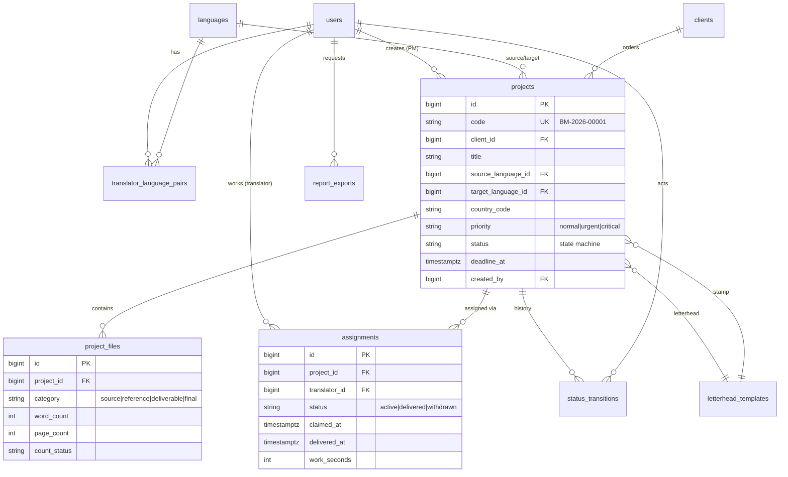

# 01 — Database Schema

PostgreSQL 16. All tables have `id` (bigint identity), `created_at`, `updated_at` unless noted.
Soft deletes (`deleted_at`) only where marked. All money as `decimal(12,2)`, all timestamps as `timestamptz`.

## ERD (core entities)



## Tables

### users
| Column | Type | Notes |
|---|---|---|
| name | varchar(150) | |
| email | varchar(190) | unique |
| phone | varchar(30) | nullable |
| password | varchar | bcrypt |
| status | varchar(20) | `active` / `suspended` — suspension takes effect immediately (token check) |
| locale | varchar(5) | default `ar` |
| monthly_word_target | int | nullable — reporting target for translators only. **Not** a pay figure |
| last_login_at | timestamptz | nullable |
| deleted_at | timestamptz | soft delete |

Roles & permissions via **spatie/laravel-permission** tables (`roles`, `permissions`, `model_has_roles`, …).
Seeded roles: `admin`, `project_manager`, `translator`, `accountant`.

### languages
| Column | Type | Notes |
|---|---|---|
| code | varchar(10) | unique, ISO 639-1 (+ variants), e.g. `ar`, `en`, `fr` |
| name_ar / name_en | varchar(80) | |
| is_rtl | boolean | |
| is_active | boolean | |

### translator_language_pairs
Controls **which projects appear in a translator's portal**.

| Column | Type | Notes |
|---|---|---|
| user_id | FK users | |
| source_language_id | FK languages | |
| target_language_id | FK languages | |

Unique: `(user_id, source_language_id, target_language_id)`.

### clients
| Column | Type | Notes |
|---|---|---|
| name | varchar(190) | |
| type | varchar(20) | `individual` / `company` |
| phone / email | varchar | nullable |
| notes | text | nullable |
| created_by | FK users | |
| deleted_at | timestamptz | soft delete |

### projects — central entity
| Column | Type | Notes |
|---|---|---|
| code | varchar(20) | unique, generated `BM-YYYY-NNNNN` |
| client_id | FK clients | nullable (internal jobs) |
| title | varchar(255) | |
| source_language_id / target_language_id | FK languages | |
| country_code | varchar(2) | ISO 3166-1, document origin country |
| service_type | varchar(30) | `certified` / `regular` — extensible |
| priority | varchar(20) | `normal` / `urgent` / `critical` |
| status | varchar(30) | see [02-state-machine.md](02-state-machine.md) |
| declared_pages | int | PM's initial estimate, nullable |
| total_words / total_pages | int | aggregated from source files after counting |
| deadline_at | timestamptz | |
| instructions | text | nullable, special instructions |
| quoted_amount | decimal(12,2) | nullable; currency `EGP` default |
| letterhead_id / stamp_id | FK letterhead_templates | nullable until approval |
| created_by | FK users | the PM |
| published_at / completed_at / cancelled_at | timestamptz | nullable milestones |
| cancel_reason | text | nullable |
| deleted_at | timestamptz | soft delete (admin only) |

Indexes: `status`, `(status, priority, deadline_at)` (portal query), `deadline_at`, `client_id`, `created_by`,
`(source_language_id, target_language_id, status)` (portal language filter).

### project_files
| Column | Type | Notes |
|---|---|---|
| project_id | FK projects | |
| category | varchar(20) | `source` (work file) / `reference` (passport, supporting docs) / `deliverable` (translator upload) / `final` (letterhead-merged output) |
| uploaded_by | FK users | |
| original_name | varchar(255) | |
| disk_path | varchar(500) | S3 key; downloads only via signed temporary URLs |
| mime_type | varchar(120) | |
| size_bytes | bigint | |
| word_count / page_count | int | nullable |
| count_status | varchar(20) | `pending` / `processing` / `done` / `failed` / `not_applicable` |
| count_source | varchar(10) | `auto` / `manual` — manual fallback for scanned docs (OCR is Phase 2) |
| version | int | default 1; re-uploads increment |

Index: `(project_id, category)`.

### assignments — the claim record
| Column | Type | Notes |
|---|---|---|
| project_id | FK projects | |
| translator_id | FK users | |
| status | varchar(20) | `active` / `delivered` / `withdrawn` |
| claimed_at | timestamptz | set on claim — time tracking starts |
| delivered_at | timestamptz | set on delivery — time tracking ends |
| work_seconds | int | computed & stored at delivery |
| withdrawn_at | timestamptz | nullable |
| withdrawn_by | FK users | nullable — PM/admin who withdrew |
| withdraw_reason | text | nullable, required by UI on withdraw |

**Critical DB-level guarantees (partial unique indexes):**

```sql
-- A translator can hold at most ONE active assignment (rule: no new file until delivery)
CREATE UNIQUE INDEX one_active_per_translator
  ON assignments (translator_id) WHERE status = 'active';

-- A project can have at most ONE active assignment (rule: exclusive claim)
CREATE UNIQUE INDEX one_active_per_project
  ON assignments (project_id) WHERE status = 'active';
```

Even if application code regresses, double-claiming is **impossible** at the database level.

### daily_word_logs — the translator's own account of a day
| Column | Type | Notes |
|---|---|---|
| user_id | FK users cascade | |
| work_date | date | |
| declared_words | int | what the translator says they produced that day |
| note | text | nullable — e.g. "ملف عقود صعب" |

Unique: `(user_id, work_date)` — re-submitting a day overwrites it. Index on `work_date`.

Deliberately **not** the same number the system computes. The system knows words per
*delivery*, so a file claimed Monday and delivered Thursday lands entirely on Thursday;
this table is the smoother, self-reported view. Reports show the two side by side and
the variance between them — that gap is the feature, not a bug to reconcile away.

Self-reported figures that managers read, so every edit is written to `activity_log`
under the `daily-words` log name.

### status_transitions — lifecycle history
| Column | Type | Notes |
|---|---|---|
| project_id | FK projects | |
| from_status / to_status | varchar(30) | |
| actor_id | FK users | nullable (system transitions e.g. merge job) |
| note | text | nullable (withdraw reason, rejection note…) |
| created_at | timestamptz | no updated_at — immutable |

### letterhead_templates
| Column | Type | Notes |
|---|---|---|
| name | varchar(150) | |
| kind | varchar(20) | `letterhead` (full-page PDF/DOCX background) / `stamp` (PNG with transparency) |
| disk_path | varchar(500) | |
| preview_path | varchar(500) | rendered thumbnail for picker UI |
| placement | jsonb | stamp positioning: page(s), x/y anchor, scale |
| is_active | boolean | |
| created_by | FK users | |

### report_exports — async report generation
| Column | Type | Notes |
|---|---|---|
| user_id | FK users | requester |
| report_type | varchar(50) | `translator_performance`, `pm_performance`, `monthly_summary`, `projects_registry` |
| params | jsonb | filters (date range, user, language, status…) |
| format | varchar(10) | `xlsx` / `pdf` |
| status | varchar(20) | `queued` / `processing` / `done` / `failed` |
| disk_path | varchar(500) | nullable until done |

### quote_requests — public-site enquiries (M13, soft-deleted)
| Column | Type | Notes |
|---|---|---|
| reference | varchar(20) UK | `RQ-4KX7-9M2D` — **random, never sequential**; it is the visitor's only credential, so a countable code would expose everyone else's quote |
| name / email / phone / organization | varchar | the requester; no user account is ever created |
| title, source_language_id, target_language_id | | languages nullable — visitors often don't know, the manager fills them in at conversion |
| service_type, priority, declared_pages, needed_by, details | | as submitted |
| status | varchar(30) | `new` → `reviewing` → `quoted` → `accepted` → `converted`, plus `declined`. Own lane; **not** the project state machine |
| quoted_amount, currency, turnaround_days, response_note | | our answer |
| responded_at, responded_by | | null until sent — the public resource gates the figures on this, so a half-typed price never leaks |
| client_id, project_id | FK, nullable | set at conversion; `project_id` non-null means terminal |
| ip_address, user_agent | varchar | light abuse trace for an endpoint anyone can POST to |

Indexes: `status`, `email`, `(status, priority, created_at)` for triage ordering.

### quote_request_files — visitor uploads (M13)
| Column | Type | Notes |
|---|---|---|
| quote_request_id | FK cascade | |
| original_name, disk_path, mime_type, size_bytes | | |

Separate from `project_files` deliberately: untrusted uploads with no uploader account,
no word counting and no category. Conversion **copies** them into the project (originals
stay put, so the priced evidence survives later revisions).

### Supporting tables
- **notifications** — standard Laravel notifications table (in-app), mail sent in parallel via queue.
- **activity_log** — spatie/laravel-activitylog; records every create/update/state-change with causer. Admin-read-only UI. No update/delete endpoints — immutable by construction.
- **settings** — key/jsonb value: due-soon threshold (default 24h), working hours, notification toggles, `company_id` ready for multi-tenancy.

## Concurrency strategy

The claim operation (the heart of the system):

```sql
BEGIN;
  -- lock the project row; second concurrent claimer blocks here
  SELECT id, status FROM projects WHERE id = :id FOR UPDATE;
  -- verify still 'available' (loser of the race sees 'claimed' and aborts with 409)
  INSERT INTO assignments (project_id, translator_id, status, claimed_at)
    VALUES (:id, :translator, 'active', now());  -- partial unique indexes enforce both rules
  UPDATE projects SET status = 'claimed' WHERE id = :id;
COMMIT;
```

Then broadcast `ProjectClaimed` on Reverb → the project disappears from all other translators' portals in real time.
UI failure path: loser gets a friendly "تم استلام الملف من مترجم آخر" toast and the list refreshes.

## Derived data (never stored as status)

- **Late** (`متأخر`): `deadline_at < now()` AND status not in (`completed`, `cancelled`, `archived`).
- **Due soon**: `deadline_at` within threshold (setting, default 24h) AND not delivered.
- Both are computed in queries/scopes and flagged by a scheduled command (every 5 min) for notifications — a project must never be "stuck" in a `late` status after delivery.
