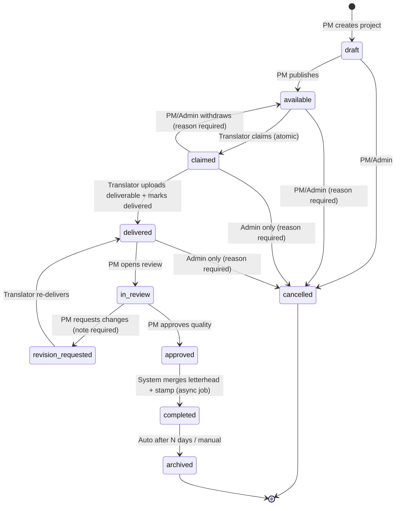

# 02 — Project State Machine

**⚠️ This document requires client sign-off before Sprint 2 begins.**
Every status change goes through a single `TransitionService` — no code path may set `projects.status` directly.
Every transition writes a row to `status_transitions` and an activity-log entry.

## Lifecycle diagram

## Status definitions

| Status | Arabic | Meaning | Time tracking |
|---|---|---|---|
| `draft` | مسودة | PM is preparing; invisible to translators | — |
| `available` | متاح | Published to portal; visible to translators with matching language pair | — |
| `claimed` | قيد التنفيذ | Exclusively claimed by one translator | **⏱ starts at claim** |
| `delivered` | تم التسليم | Deliverable uploaded, awaiting review | **⏱ stops at delivery** |
| `in_review` | قيد المراجعة | PM reviewing quality | — |
| `revision_requested` | مطلوب تعديل | Returned to the **same** translator (stays assigned; portal lock stays) | ⏱ revision time tracked separately on the assignment |
| `approved` | معتمد | Quality approved; PM selects letterhead + stamp | — |
| `completed` | مكتمل | Final merged file ready; client can be served | — |
| `archived` | مؤرشف | Read-only, out of active dashboards | — |
| `cancelled` | ملغي | Terminated; reason mandatory | — |

## Transition permission matrix

| # | Transition | Translator | PM | Admin | System |
|---|---|:---:|:---:|:---:|:---:|
| 1 | draft → available | — | ✅ | ✅ | — |
| 2 | available → claimed | ✅ (self, language-pair match, no other active file) | — | — | — |
| 3 | claimed → delivered | ✅ (assignee only, deliverable file required) | — | — | — |
| 4 | claimed → available (withdraw) | — | ✅ reason | ✅ reason | — |
| 5 | delivered → in_review | — | ✅ | ✅ | auto-open when PM views |
| 6 | in_review → revision_requested | — | ✅ note required | ✅ | — |
| 7 | revision_requested → delivered | ✅ (assignee only) | — | — | — |
| 8 | in_review → approved | — | ✅ | ✅ | — |
| 9 | approved → completed | — | — | — | ✅ merge job success |
| 10 | completed → archived | — | ✅ | ✅ | ✅ auto after 30 days (setting) |
| 11 | draft/available → cancelled | — | ✅ reason | ✅ reason | — |
| 12 | claimed/delivered → cancelled | — | — | ✅ reason | — |

Any transition not listed is **forbidden** and returns HTTP 422.

## Business rules & edge cases (client must confirm)

1. **Withdraw (sick/absent translator):** PM withdraws → assignment becomes `withdrawn` (work time preserved for the record), project returns to `available`, all matching translators get notified. The withdrawn translator's portal lock is released — they may claim other files.
2. **Revision loop:** revision does **not** release the translator's lock — they cannot claim new files until the revision is delivered and approved. Revision cycles are counted; ≥ 2 cycles flags the project on the PM dashboard.
3. **Merge failure (letterhead job):** stays `approved`, PM + admin notified with error detail; retry button. Never silently completes.
4. **Deadline passes:** status does NOT change — `late` is a computed flag. Late projects float to top of PM dashboard; notifications fire once per escalation level (due-soon → late), not repeatedly.
5. **Cancel while claimed:** admin-only, requires reason; assignment marked `withdrawn`, translator notified and unlocked, work time preserved.
6. **Re-upload before review:** translator may replace the deliverable while status is `delivered` (new file version); after `in_review` starts, uploads are locked.
7. **Suspended user:** active tokens invalidated; if they held a claimed file, admin must withdraw it explicitly (system flags it on the admin dashboard).

## Notification triggers

| Event | In-app | Email | Recipients |
|---|:---:|:---:|---|
| Project published | ✅ | — | Translators with matching language pair |
| Project claimed | ✅ | — | Project's PM |
| Deliverable uploaded (delivered) | ✅ | ✅ | Project's PM |
| Revision requested | ✅ | ✅ | Assignee translator |
| Approved & merge done (completed) | ✅ | ✅ | PM + admin |
| Merge failed | ✅ | ✅ | PM + admin |
| Due soon (threshold, default 24h) | ✅ | ✅ | Assignee + PM |
| Late (deadline passed) | ✅ | ✅ | Assignee + PM + admin |
| Withdrawn | ✅ | ✅ | Withdrawn translator + matching translators (re-available) |

Realtime (Reverb) channels:
- `portal.{source_lang}.{target_lang}` — publish/claim/withdraw events keep every translator's queue live.
- `user.{id}` — personal notifications badge.
- `pm.projects` — delivery/late events for PM dashboards.
