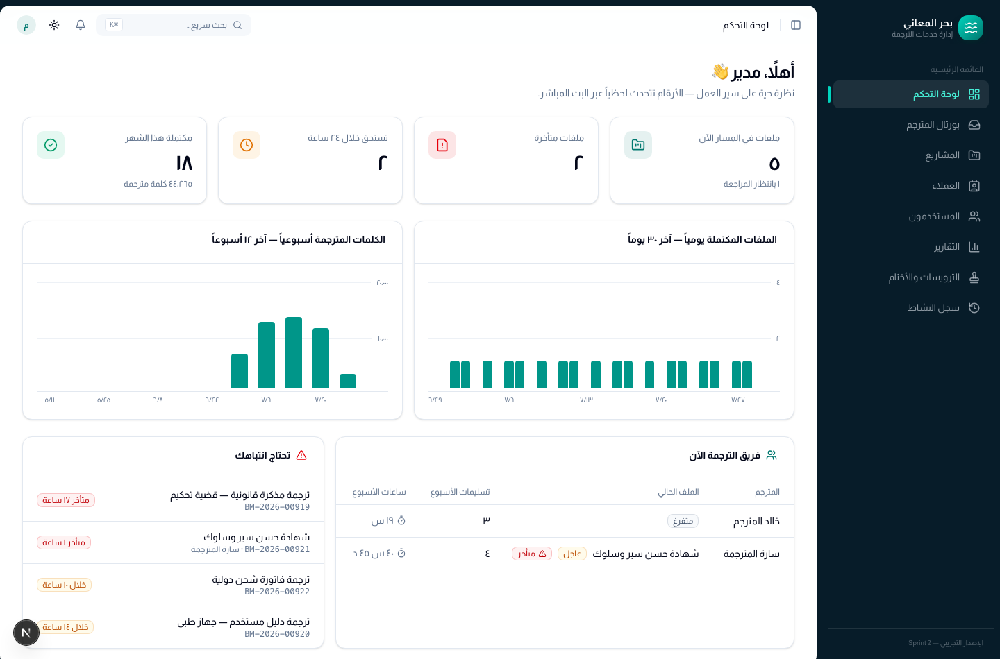
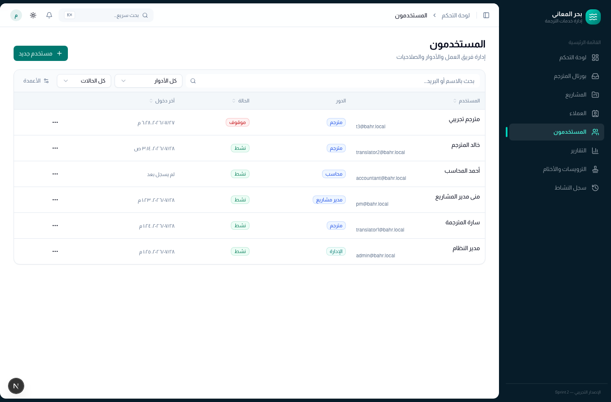
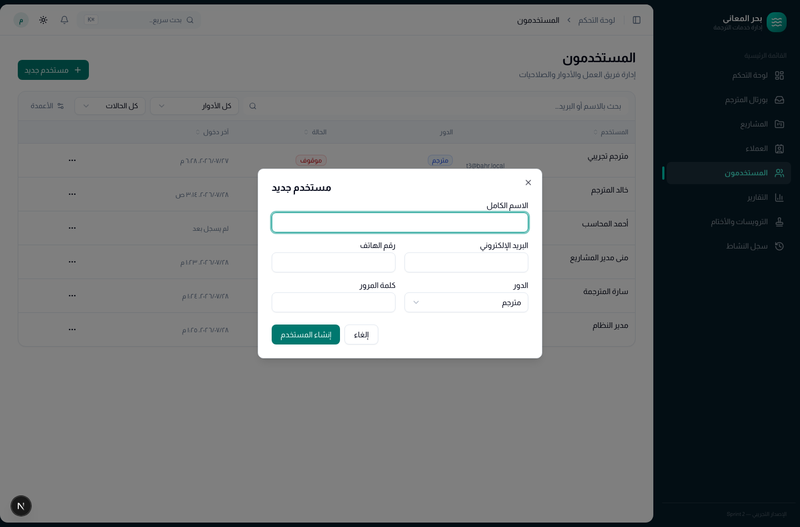
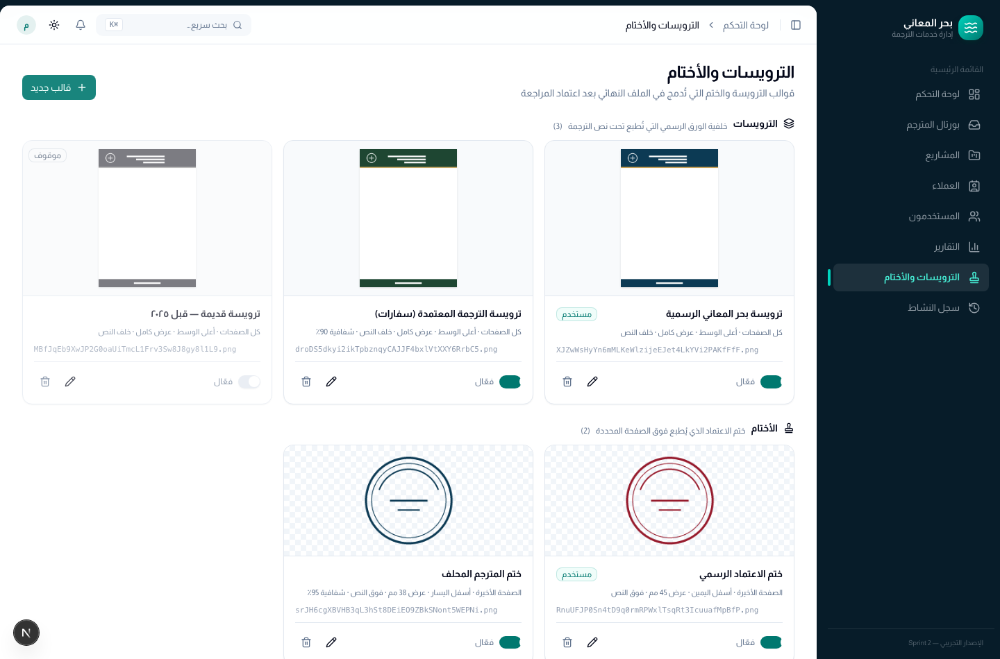
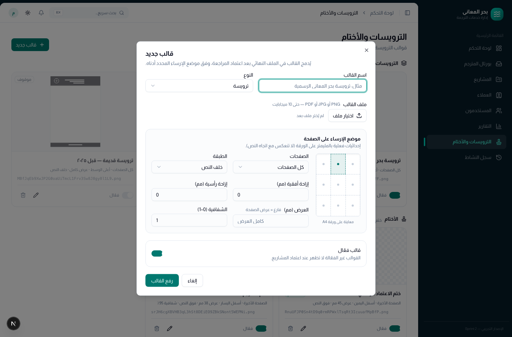
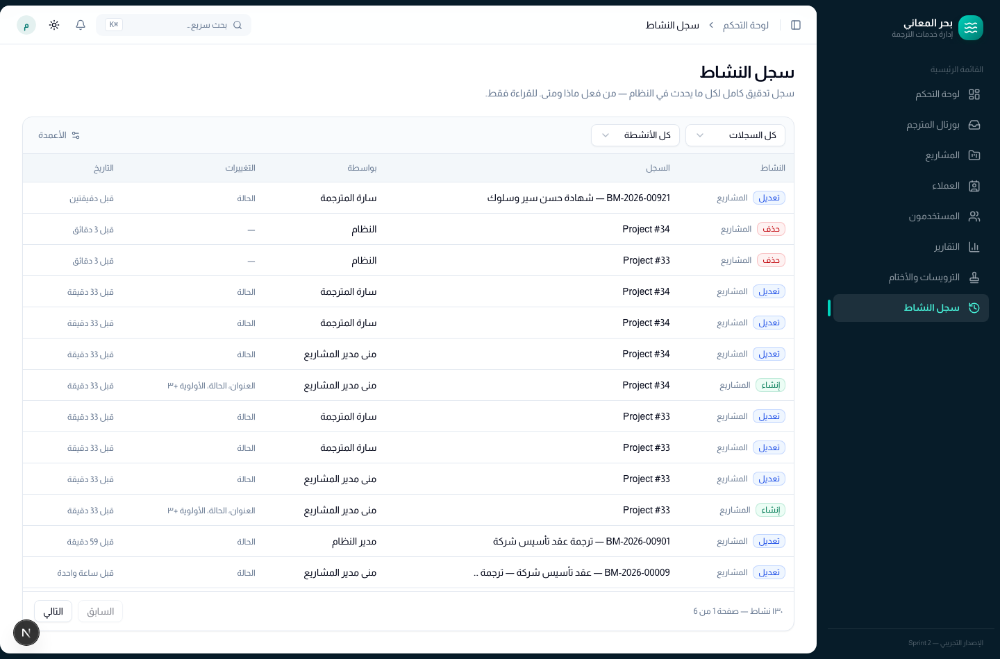

# دليل مدير النظام — بحر المعاني

كل ما يخصّ إدارة الحسابات والصلاحيات وقوالب الترويسات ومتابعة سجل التدقيق.
دور **الإدارة** يرى كل شيء في النظام ويشمل صلاحيات مدير المشاريع كاملة.

---

## 1. لوحة التحكم

نفس مؤشرات مدير المشاريع، لكن على مستوى الشركة كلها: الملفات في المسار،
المتأخر، ما يستحق خلال ٢٤ ساعة، المكتمل هذا الشهر، ومنحنيات الإنتاجية وأحمال
الفريق.

---

## 2. المستخدمون والأدوار

**المستخدمون** تعرض فريق العمل كاملاً مع الدور والحالة وآخر دخول، مع بحث وتصفية
بالدور والحالة.

### إضافة مستخدم

**مستخدم جديد** ← الاسم، البريد (وهو اسم الدخول)، الهاتف، كلمة المرور، والدور.

الأدوار الأربعة وصلاحياتها:

| الدور | يرى ويفعل |
|---|---|
| **الإدارة** | كل شيء: المستخدمون، الصلاحيات، القوالب، سجل النشاط، كل المشاريع |
| **مدير مشاريع** | العملاء والمشاريع ودورة حياتها كاملة، التقارير، اختيار الترويسة عند الاعتماد |
| **مترجم** | بورتال المترجم فقط — بلا بيانات عميل أو أسعار |
| **محاسب** | التقارير والبيانات المالية، بلا تدخّل في سير العمل |

### أزواج اللغة للمترجمين

المترجم **لا يرى أي ملف** حتى تُسجَّل له أزواج اللغة (مثلاً: إنجليزي ← عربي،
فرنسي ← عربي). تُدار من قائمة إجراءات المستخدم. زوج اللغة هو ما يحدّد أي
الملفات تظهر في بورتاله.

### إيقاف حساب

**إيقاف الحساب** يُنهي جلسات المستخدم فوراً على كل الأجهزة ويمنع الدخول، مع بقاء
كل سجلّه وأعماله كما هي. استخدمه بدل الحذف عند انتهاء التعاقد؛ الحذف للحسابات
المُنشأة بالخطأ فقط.

> لا يمكنك إيقاف أو حذف حسابك أنت — حماية من قفل النظام على نفسك.

---

## 3. حسابات العملاء على الموقع

للعميل حساب منفصل تماماً عن حسابات فريق العمل: يدخل من **الموقع** لا من النظام،
ولا يرى شيئاً سوى مشاريعه هو.

### فتح حساب لعميل موجود

من **العملاء** افتح ملف العميل (اضغط اسمه)، ثم **فتح حساب للعميل** — أو من زر
**تعديل**. اكتب بريده الإلكتروني وكلمة مرور (٨ أحرف على الأقل) واحفظ. يدخل بها
من `‎/account/login` على الموقع، وتظهر له فوراً **كل** مشاريعه وفواتيره السابقة.

> ترك حقلي كلمة المرور فارغين عند التعديل يعني «اترك الحساب كما هو»، لا إلغاءه.
> كتابة كلمة مرور جديدة تُنهي جلسات العميل المفتوحة على كل الأجهزة.

### العميل الذي يسجّل بنفسه

يستطيع الزائر إنشاء حساب من الموقع مباشرة، ويظهر عندك في **العملاء** بعلامة
«سجّل بنفسه من الموقع». إن كان بريده مسجلاً لدينا أصلاً فالتسجيل **يُرفض** ويُطلب
منه التواصل مع المكتب — لأن لا شيء يثبت أن البريد بريده، ولا يصح أن يستولي أحد
على سجل عميل آخر. في هذه الحالة افتح له الحساب بنفسك على ملفه القديم كما في
الفقرة السابقة.

### إيقاف أو إلغاء حساب عميل

- **إيقاف** (من نافذة التعديل، حالة الحساب ← موقوف): يمنع الدخول وينهي جلساته،
  ويبقى الحساب قابلاً لإعادة التفعيل.
- **إلغاء حساب الموقع**: يحذف كلمة المرور فقط. يبقى العميل ومشاريعه وفواتيره
  كما هي تماماً — لا يفقد المكتب شيئاً.

> **تنبيه:** لا توجد حالياً خاصية «نسيت كلمة المرور» لأن بريد النظام في الإنتاج
> ما زال غير مضبوط (`MAIL_HOST=smtp.example.com`). حتى تُضبط، أعِد تعيين كلمة
> مرور العميل من هذه الشاشة عند طلبه.

### ماذا يرى العميل — وماذا لا يرى

يرى: مشاريعه بمراحلها المبسّطة (قيد التنفيذ / قيد المراجعة / جاهز للاستلام /
مكتمل)، عدد الصفحات والكلمات، الملفات المعتمدة والملفات التي أرسلها، وفواتيره.

**لا يرى:** الحالات الداخلية للإنتاج (متاح، تم السحب، تم التسليم…)، ولا اسم
المترجم، ولا عدد مرات إعادة العمل، ولا الملاحظات الداخلية المكتوبة عنه، ولا
المشاريع التي ما زالت **مسودّة** عندك.

---

## 4. الترويسات والأختام

القوالب التي تُدمج في الملف النهائي بعد الاعتماد.

**قالب جديد** يرفع صورة PNG/JPG أو ملف PDF (حتى ١٠ ميجابايت) ويحدّد موضع
الإرساء على الورقة:

| الإعداد | المعنى |
|---|---|
| **النوع** | ترويسة (خلفية الصفحة) أو ختم (توقيع/اعتماد) |
| **الصفحات** | كل الصفحات · الأولى فقط · الأخيرة فقط |
| **موضع الإرساء** | شبكة ٣×٣ — إحداثيات **فعلية على الورقة** ولا تنعكس مع اتجاه النص |
| **الإزاحة (مم)** | تحريك دقيق أفقياً ورأسياً عن نقطة الإرساء |
| **العرض (مم)** | فارغ = عرض الصفحة كاملاً |
| **الشفافية** | ٠–١ (للأختام فوق النص عادةً ٠٫٩ فأعلى) |
| **الطبقة** | خلف النص (ترويسة) أو فوق النص (ختم) |

المعاينة على ورقة A4 تُظهر الموضع النهائي قبل الحفظ.

**قالب فعّال / موقوف**: القوالب الموقوفة لا تظهر لمدير المشاريع عند الاعتماد،
لكنها تبقى محفوظة للمشاريع القديمة التي استخدمتها. لهذا لا يمكن حذف قالب
مستخدَم في مشاريع — أوقفه بدل حذفه.

---

## 5. سجل النشاط

سجل تدقيق كامل: من فعل ماذا ومتى، مع قيم ما قبل وبعد لكل تعديل. للقراءة فقط،
ولا يمكن لأحد تعديله أو مسحه من داخل النظام.

يمكن التصفية بنوع النشاط (إنشاء / تعديل / حذف) وبنوع السجل (مشاريع، مستخدمون،
عملاء…). اضغط أي صف لعرض تفاصيل التغيير.

---

## 6. الإشعارات والإعدادات الشخصية

الجرس هو المرجع لكل ما يحدث ويخصّك، ويصل لحظياً.

من قائمة حسابك ← **الإعدادات** تتحكم في نسخة **البريد الإلكتروني** لكل نوع
إشعار على حدة (ملف جديد متاح، تسليم ترجمة، طلب تعديل، سحب ملف، تنبيهات المواعيد،
جاهزية التقارير). الإيقاف هنا يمنع البريد فقط — الجرس يبقى مفعّلاً دائماً.

---

## 7. مهام دورية موصى بها

| متى | ماذا |
|---|---|
| عند انضمام موظف | إنشاء الحساب + الدور، وأزواج اللغة إن كان مترجماً |
| عند انتهاء التعاقد | **إيقاف** الحساب (لا تحذفه) |
| عند تغيير الترويسة الرسمية | رفع قالب جديد ثم **إيقاف** القديم — لا تحذفه |
| أسبوعياً | مراجعة سجل النشاط للحذف والتعديلات غير المتوقعة |
| شهرياً | تصدير التقرير الشهري للأرشيف المحاسبي |

---

## 8. مسائل تقنية

النشر على الخادم، النسخ الاحتياطي، وفحوص السلامة موثّقة في
[`docs/DEPLOYMENT.md`](DEPLOYMENT.md) — يحتاجها مسؤول الخادم لا مدير النظام.

نقاط تهمّك منها:

- **النسخ الاحتياطي** يجب أن يشمل قاعدة البيانات **و** مجلد التخزين معاً (ملفات
  المصدر والتسليمات والقوالب والملفات النهائية).
- **البريد الصادر** يحتاج مزوّد SMTP حقيقي؛ إن توقف وصول الرسائل فالمشكلة غالباً
  في إعدادات المزوّد لا في النظام — الجرس يبقى يعمل في كل الأحوال.
