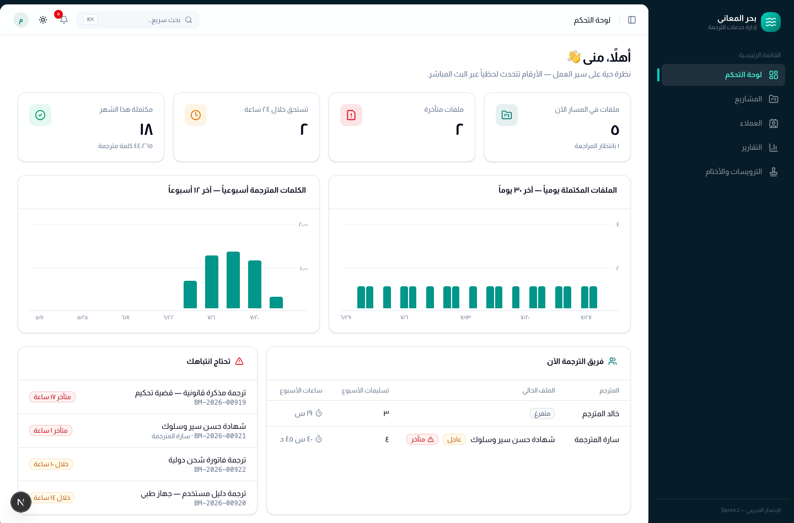
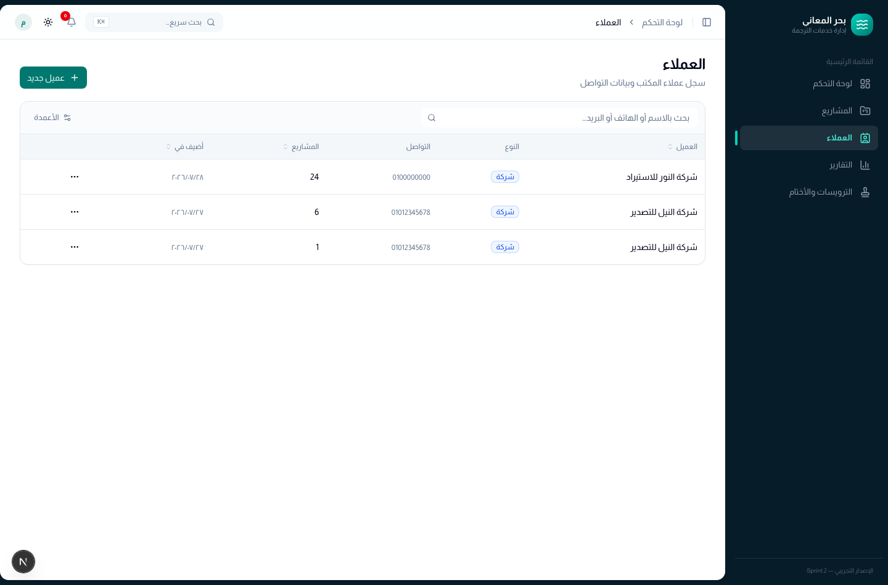
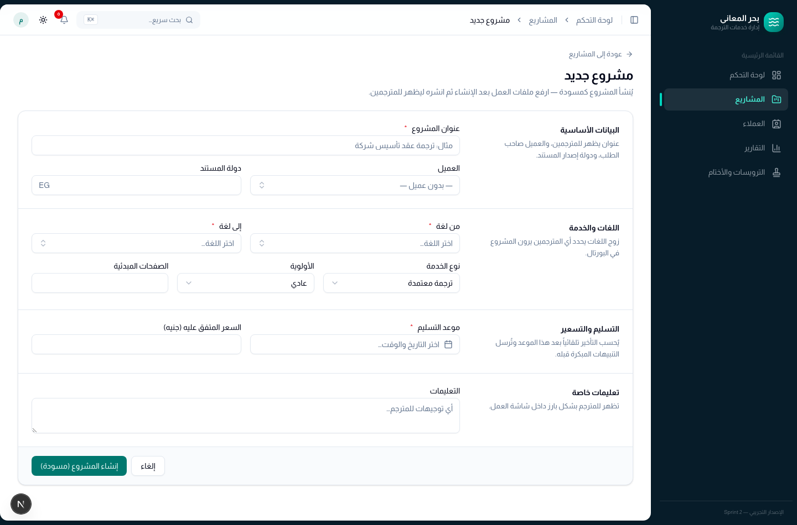
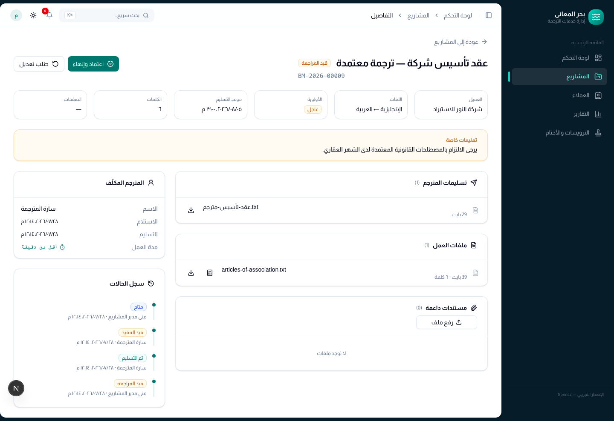
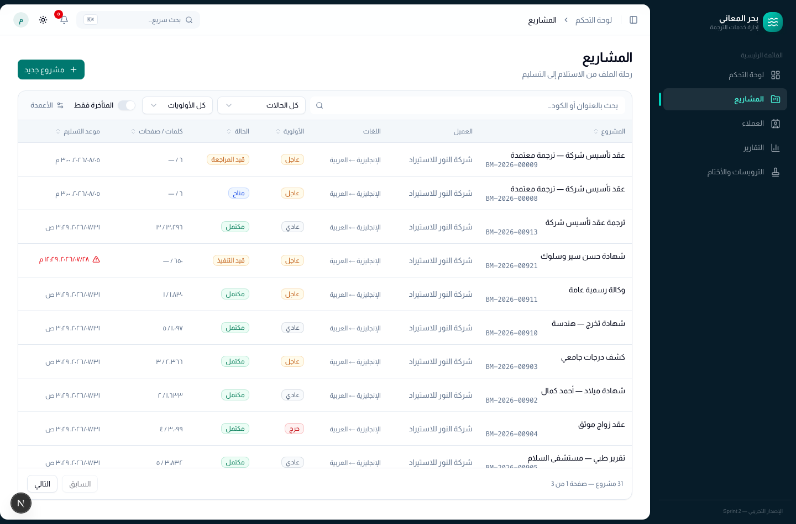
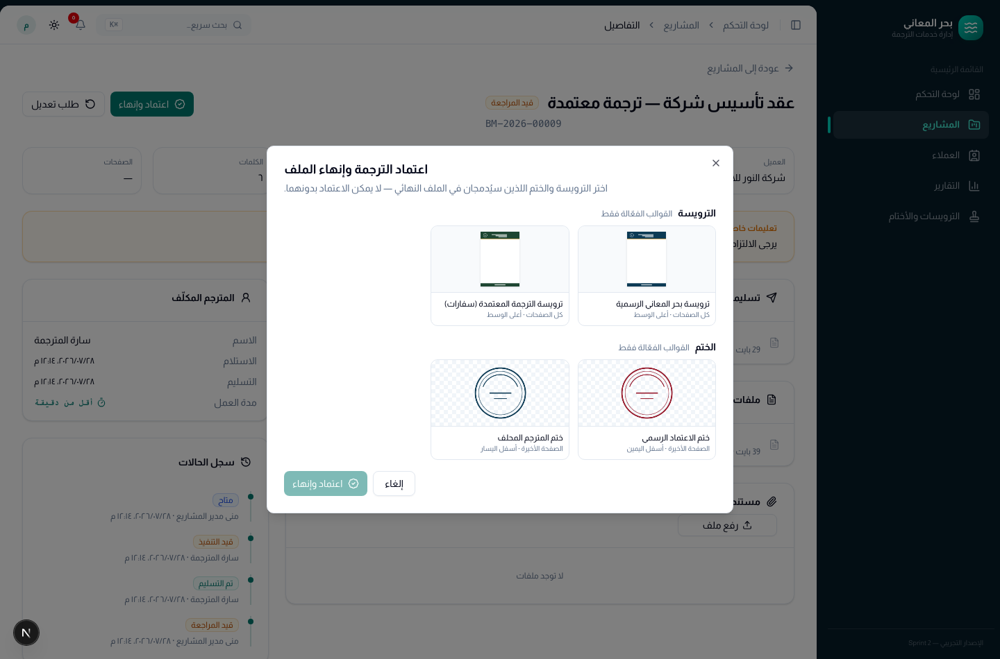
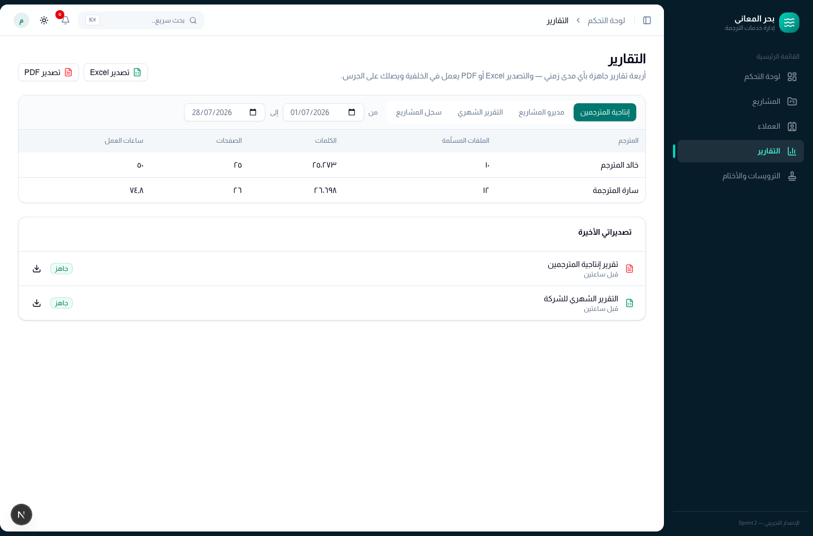

# دليل مدير المشاريع — بحر المعاني

دورة حياة الملف من استلامه من العميل حتى تسليمه معتمداً، ومن يفعل ماذا في كل خطوة.

---

## 1. لوحة التحكم

أول ما تراه بعد الدخول: أرقام لحظية عن حالة العمل — ملفات في المسار، ملفات
متأخرة، ما يستحق خلال ٢٤ ساعة، والمكتمل هذا الشهر. تحتها منحنيات الإنتاجية،
وقائمة **تحتاج انتباهك** (المتأخر والمقترب موعده)، و**فريق الترجمة الآن**
(من يعمل على ماذا، وكم سلّم هذا الأسبوع).

الأرقام تتحدث لحظياً عبر البث المباشر — لا حاجة لتحديث الصفحة.

---

## 2. العملاء

قبل إنشاء مشروع، تأكد أن العميل مسجّل: **العملاء ← عميل جديد** (فرد أو شركة،
مع بيانات التواصل والملاحظات).

---

## 3. إنشاء مشروع

**المشاريع ← مشروع جديد**. الحقول المعلّمة بنجمة إلزامية:

| الحقل | ملاحظات |
|---|---|
| العنوان | وصف مختصر يظهر للمترجم |
| العميل | اختياري في المسودة، مطلوب للفوترة لاحقاً |
| اللغتان | زوج اللغة يحدّد من يرى الملف في البورتال |
| نوع الخدمة | معتمدة / عادية |
| الأولوية | عادي · عاجل · حرج (تؤثر على ترتيب البورتال) |
| موعد التسليم | يُحسب عليه التأخير والتنبيهات |
| التعليمات الخاصة | تظهر للمترجم بشكل بارز |

يُنشأ المشروع في حالة **مسودة**، ولا يراه أحد غيرك بعد.

### مشروع يضيفه العميل من حسابه

العميل الذي له حساب على الموقع لا يحتاج إلى طلب عرض سعر في كل مرة: يضغط **مشروع جديد**
في حسابه، ويرفع المستندات ويختار اللغتين والموعد الذي يحتاجه. يصل إشعار لكل مديري
المشاريع، ويظهر المشروع في القائمة **مسودةً** بعلامة **من العميل**، مربوطاً بالعميل،
وملفاته ملفات عمل معدودة.

- لا يصل إلى المترجمين قبل أن تنشره أنت. راجِع الموعد (هو ما طلبه العميل، فعدّله إن
  لزم) واختر الترويسة والختم، وضع التكلفة إن أردت أن يراها العميل، ثم **نشر للمترجمين**.
- المسودة لا تتبع أحداً حتى يعدّلها أو ينشرها أحد مديري المشاريع، فتصبح مشروعه من
  تلك اللحظة، وتصله إشعارات تسليمها ومواعيدها.
- يرى العميل المشروع في حسابه بحالة **بانتظار مراجعة المكتب**، ويستطيع حتى النشر
  إضافة ملفات للترجمة أو حذف ما رفعه منها. بعد النشر تُقفل ملفات العمل كالمعتاد.

---

## 4. رفع الملفات ثم النشر

من صفحة المشروع ارفع **ملفات العمل** (المصدر) وأي **مستندات داعمة** (مراجع،
نماذج سابقة). يبدأ النظام تلقائياً بعدّ الكلمات:

- ملفات Word وملفات PDF النصية → عدّ آلي.
- ملفات PDF الممسوحة ضوئياً (صور) → تُعلَّم «غير قابل للعدّ» مع إمكانية إدخال
  العدد يدوياً.

بعد رفع ملف مصدر واحد على الأقل يصبح زر **نشر للمترجمين** فعّالاً. النشر ينقل
المشروع إلى **متاح**، ويظهر فوراً في بورتال كل مترجم يطابق زوج اللغة، مع إشعار.

> ملفات المصدر لا تُرفع ولا تُحذف بعد النشر — الحماية مقصودة حتى لا يتغيّر العمل
> تحت يد المترجم. المستندات الداعمة يمكن إضافتها في أي وقت.

### طلب مستند من العميل (هوية أو مستند داعم)

إن اكتشفت أن ملفاً لا يمكن إتمام ترجمته بدون مستند آخر — بطاقة صاحب الشهادة
لضبط تهجئة الاسم مثلاً — اضغط أيقونة **طلب مستند** بجوار الملف نفسه، أو زر
**طلب مستند** في بطاقة «مستندات مطلوبة من العميل». اختر نوع المستند، والملف
المعني، واكتب ملاحظة للعميل.

- يظهر الطلب للعميل في أعلى صفحة المشروع بحسابه على الموقع، ويرفع المستند من
  هناك مباشرة. يصلك إشعار فور وصوله.
- الطلب مرتبط بالملف نفسه لا بالمشروع ككل — في دفعة فيها أربع شهادات لأربعة
  أشخاص، يعرف العميل والمترجم هوية مَن المطلوبة.
- إن وصل المستند بالبريد أو واتساب فارفعه بنفسك من **رفع نيابة عن العميل**:
  يُغلق الطلب ويظهر للعميل أنه وصل، فلا يبقى حسابه يطالبه بمستند لديك بالفعل.
- المستند يظهر للمترجم المكلّف ضمن ملفات المشروع، وهو المقصود: الاسم كما هو في
  الهوية هو ما يُكتب في الترجمة المعتمدة.
- طالما الطلب مفتوح يظهر على المشروع وسم **بانتظار مستند من العميل** في القائمة
  وفي صفحة المشروع. ليست حالة جديدة — المشروع يبقى في حالته كما هي.

#### إذا وصل المستند الخطأ

يحدث كثيراً أن يرفع العميل صورة غير واضحة أو بطاقة شخص آخر. اضغط **طلب نسخة أخرى**
على الطلب، واكتب السبب — السبب إلزامي لأنه يصل للعميل نصاً، وبدونه سيعيد إرسال
الصورة نفسها.

- الملف المرفوض **لا يُحذف**: يبقى في السجل تحت «نسخ سابقة مرفوضة»، لكنه يخرج من
  قائمة ملفات المترجم فوراً. هذا هو المهم — المترجم لا يستطيع التمييز بين بطاقتين،
  وقد يكتب الاسم من البطاقة الخطأ.
- يعود الطلب إلى **بانتظار العميل** ويظهر له مربع الرفع من جديد مع سبب الرفض.
- إن أردت التخلص من الملف نهائياً (بطاقة شخص آخر مثلاً) فاضغط **حذف** بجواره —
  المستندات الداعمة المرتبطة بطلب يمكن حذفها في أي وقت قبل إغلاق المشروع، بخلاف
  ملفات العمل التي تبقى محمية بعد النشر.
- العميل نفسه يستطيع حذف ما رفعه ورفع نسخة بديلة دون الرجوع إليك؛ يصلك إشعار
  بذلك، ويعود الطلب مفتوحاً تلقائياً إن لم يبقَ عليه ملف.

> لا تُرسل رسالة البريد للعميل حالياً لأن إعدادات SMTP على الخادم لم تُضبط بعد؛
> الطلب يظهر للعميل في حسابه على كل حال.

#### ملفات يرسلها العميل دون طلب

يستطيع العميل من حسابه رفع ملفات إلى مشروعه في أي وقت قبل اكتماله أو إلغائه، دون أن
تطلبها منه، وأكثر من مرة. يصلك إشعار بكل دفعة، وتظهر الملفات في **مستندات داعمة**
بعلامة **من العميل**، ويراها المترجم ضمن ملفات المشروع.

- هذه الملفات **مستندات داعمة لا ملفات عمل**: لا تدخل في عدّ الكلمات ولا في
  التسعير. إن أرسل العميل مستنداً جديداً يحتاج ترجمة، فالقرار لك (مشروع جديد مثلاً).
- يستطيع العميل حذف ما أرسله، وتستطيع أنت حذف أي ملف منه حتى بعد النشر — مفيد إن
  رفع بطاقة شخص آخر.

---

## 5. متابعة التنفيذ

صفحة المشروع تجمع كل شيء: البيانات، الملفات، المترجم المكلّف مع مدة عمله،
وسجل الحالات كاملاً بالتوقيت ومن نفّذ كل انتقال.

تعرض قائمة المشاريع **مشاريعك أنت فقط** — التي أنشأتها أو حوّلتها من طلب تسعير —
ومعها طلبات العملاء الجديدة التي لم يستلمها مدير مشروع بعد. مشاريع زملائك لا تظهر
لك، ولا في البحث ولا في لوحة التحكم؛ الإدارة وحدها ترى مشاريع الجميع.

من قائمة المشاريع يمكنك التصفية بالحالة والأولوية والعميل وزوج اللغة والتاريخ،
والبحث الحر في العناوين والأكواد وأسماء العملاء، والترتيب بأي عمود.

### سحب ملف من مترجم

إن مرض المترجم أو تأخر بلا تواصل: **سحب الملف** مع كتابة السبب. يعود المشروع إلى
**متاح** لبقية الفريق، ويصل المترجم إشعار بالسبب. المدة التي عملها تبقى مسجّلة.

### حذف مشروع

للمشاريع المكررة أو المُدخلة بالخطأ: **حذف المشروع** من صفحة المشروع. يختفي من القوائم
ومن بورتال المترجمين فوراً، ويبقى الحذف مسجّلاً في سجل النشاط.

- متاح للمسودة، والمتاح، والملغي — **ما دام لم يستلمه مترجم قط**.
- المشروع الذي استلمه مترجم لا يُحذف حتى لو سُحب منه: وقت عمله وتسليمه مسجّلان
  عليه. استخدم **الإلغاء** بدلاً من ذلك.
- إن كان المشروع محوّلاً من طلب تسعير، يعود الطلب إلى حالة **مقبول** ويمكن تحويله من جديد.

---

## 6. المراجعة والاعتماد

عند التسليم يصلك إشعار فوري ويتحول المشروع إلى **تم التسليم**. حتى تفتح المراجعة
يستطيع المترجم تصحيح تسليمه (استبدال ملف أو إضافته أو حذفه)، ويصلك إشعار
«عُدِّل التسليم قبل المراجعة» — إن كنت نزّلت الملفات قبله فنزّلها من جديد. اضغط
**فتح المراجعة** لتصبح الحالة **قيد المراجعة** ويُقفل التسليم، ثم أمامك مساران:

**أ. طلب تعديل** — اكتب ملاحظات المراجعة (إلزامية). يعود الملف للمترجم نفسه
ويُمنع من استلام ملفات جديدة حتى يسلّم التعديل.

**ب. اعتماد وإنهاء** — تختار **الترويسة** و**الختم** اللذين سيُدمجان في الملف
النهائي. الاختيار إلزامي: لا يمكن الاعتماد بدونهما.

بعد الاعتماد يُجهّز النظام الملف النهائي وينتقل المشروع إلى **مكتمل**، ومنه
إلى **مؤرشف** بزر الأرشفة عندما يستلم العميل نسخته.

---

## 7. التقارير والتصدير

أربعة تقارير جاهزة بأي مدى زمني: إنتاجية المترجمين، مديرو المشاريع، التقرير
الشهري، وسجل المشاريع.

التصدير إلى **Excel** أو **PDF** يعمل في الخلفية: تضغط الزر، تكمل عملك، ويصلك
إشعار على الجرس عندما يصبح الملف جاهزاً للتحميل من لوحة «تصديراتي الأخيرة».

---

## 8. الإشعارات والإعدادات

الجرس يجمع كل ما يخصّك: تسليم ترجمة، اقتراب موعد، تأخّر ملف، جاهزية تقرير.

نسخة البريد اختيارية لكل نوع على حدة من قائمة حسابك ← **الإعدادات**، بينما تبقى
إشعارات الجرس مفعّلة دائماً.

---

## 9. حدود الصلاحيات

- **المترجم لا يرى العميل ولا الأسعار** إطلاقاً، ولا يصل إلا لملفات مشروعه الحالي.
- تعديل بيانات المشروع متاح في حالة **مسودة** فقط.
- تغيير الحالات يمرّ دائماً عبر أزرار النظام (نشر / سحب / مراجعة / اعتماد) —
  وكل انتقال مسجَّل باسمك ووقته في سجل الحالات وسجل النشاط.
