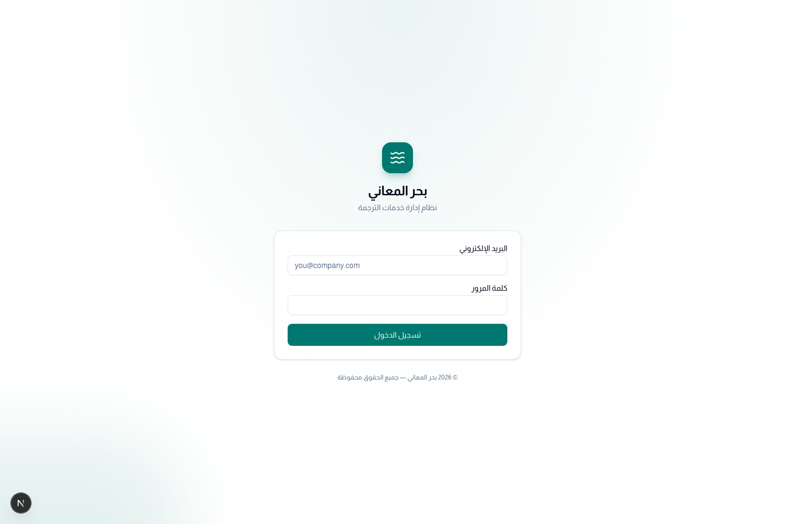
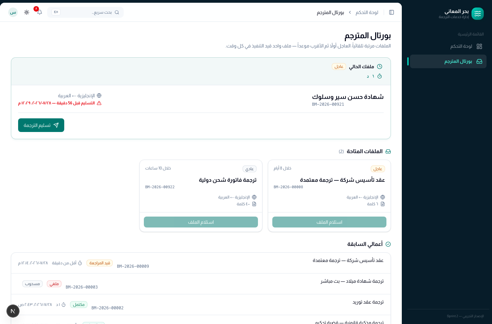
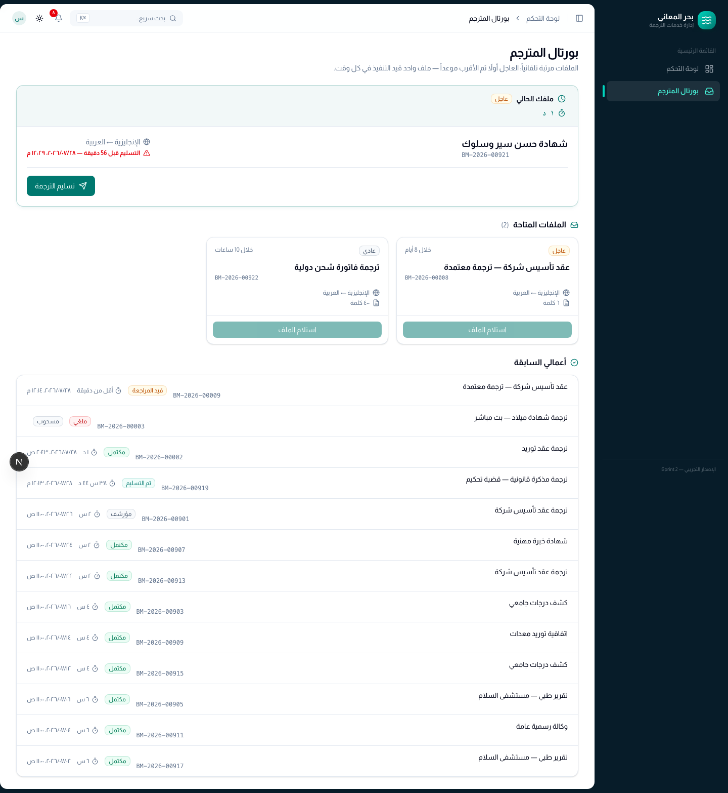
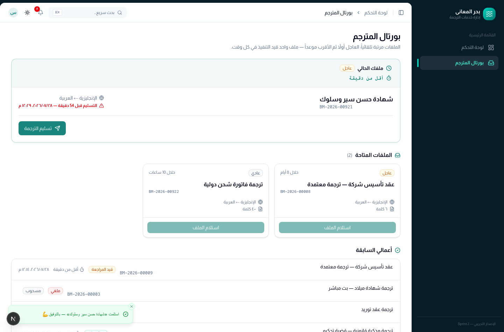
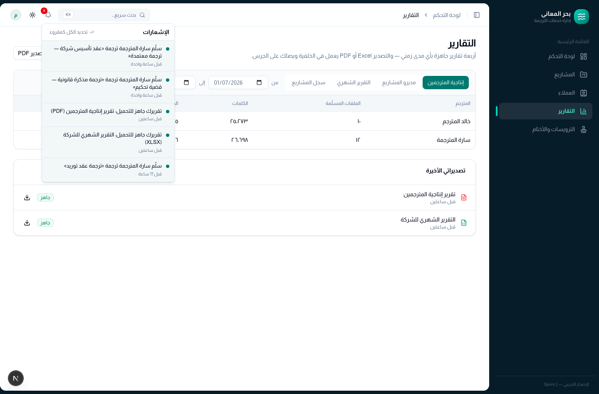
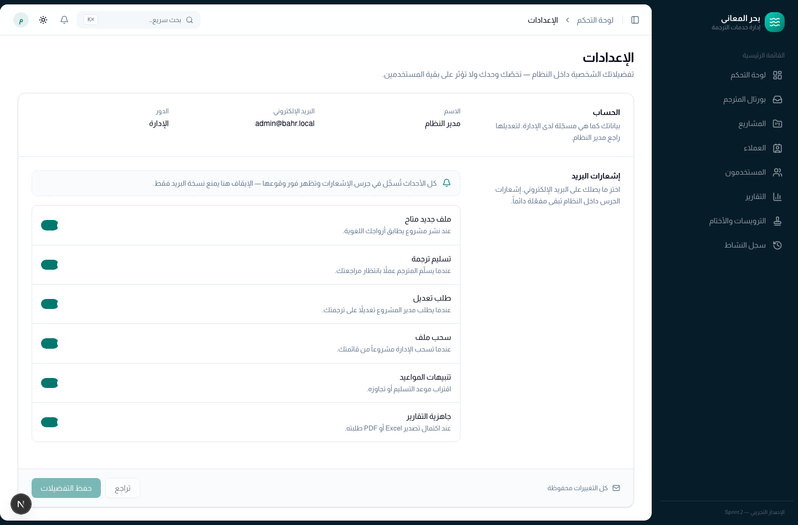

# دليل المترجم — بحر المعاني

دليل سريع لمن يعمل على ترجمة الملفات. كل ما تحتاجه في شاشة واحدة: **بورتال المترجم**.

---

## 1. الدخول

افتح رابط النظام وسجّل الدخول ببريدك وكلمة المرور التي زوّدتك بها الإدارة.

> إن نسيت كلمة المرور أو تعطّل حسابك، راجع مدير النظام — إيقاف الحساب يُنهي
> الجلسة فوراً على كل الأجهزة.

---

## 2. بورتال المترجم

هذه شاشتك الرئيسية، وتنقسم إلى ثلاثة أقسام من الأعلى إلى الأسفل:

| القسم | ماذا يعرض |
|---|---|
| **ملفك الحالي** | الملف الذي تعمل عليه الآن، مع الوقت المتبقي وزر التسليم |
| **الملفات المتاحة** | الملفات المطابقة لأزواجك اللغوية، مرتّبة: العاجل أولاً ثم الأقرب موعداً |
| **أعمالي السابقة** | سجلّك الكامل مع حالة كل ملف ومدة العمل عليه |

القائمة **حيّة**: عندما ينشر مدير المشاريع ملفاً جديداً يظهر عندك في ثوانٍ بدون
تحديث الصفحة، وإذا استلمه زميل قبلك اختفى من شاشتك في نفس اللحظة.

### ما لا يظهر لك

بيانات العميل والأسعار لا تظهر للمترجمين إطلاقاً — ترى عنوان الملف، اللغتين،
عدد الكلمات، الموعد، والتعليمات الخاصة فقط. هذا مقصود ولا يعني نقصاً في البيانات.

---

## 3. استلام ملف

اضغط **استلام الملف** على البطاقة التي تريدها.

- الاستلام بمبدأ **الأسبقية**: أول من يضغط يحصل على الملف، ومن يتأخر يرى رسالة
  «تم استلام الملف من مترجم آخر».
- **ملف واحد فقط في كل وقت.** لا يمكنك استلام ملف جديد قبل تسليم الحالي —
  ولا أثناء وجود طلب تعديل معلّق عليك.
- بمجرد الاستلام يبدأ احتساب **مدة العمل** تلقائياً.

في بطاقة الملف الحالي تجد:

- **ملفات المشروع**: ملفات العمل (المصدر) والملفات المرجعية — حمّلها من زر التحميل.
- **التعليمات الخاصة** إن كتبها مدير المشروع.
- **الموعد النهائي** — يتحول إلى تحذير أحمر عند اقترابه أو تجاوزه.

---

## 4. تسليم الترجمة

اضغط **تسليم الترجمة**، اختر ملف الترجمة النهائي، ثم أكّد.

بعد التسليم:

- يخرج الملف من عهدتك ويصبح بإمكانك استلام ملف جديد.
- يصل إشعار فوري لمدير المشروع ليبدأ المراجعة.
- تُحفظ مدة عملك على الملف في سجلّك (وتُستخدم في تقارير الإنتاجية).

---

## 5. طلب التعديل

إذا رأى مدير المشروع ما يستدعي تعديلاً، يعود الملف إليك مع **ملاحظات المراجعة**،
ويظهر مرة أخرى في «ملفك الحالي» بعلامة **مطلوب تعديل**.

- اقرأ الملاحظات، عدّل الترجمة، ثم اضغط **تسليم التعديل**.
- تُضاف مدة التعديل إلى مدة عملك الأصلية.
- لا يمكنك استلام ملفات جديدة حتى تسلّم التعديل.

---

## 6. الإشعارات

الجرس أعلى الشاشة هو سجلّك لكل ما يخصّك: ملف جديد متاح، طلب تعديل، سحب ملف،
واقتراب المواعيد. تصلك الإشعارات **فوراً** بدون تحديث الصفحة.

نسخة البريد الإلكتروني اختيارية: من قائمة حسابك ← **الإعدادات** يمكنك إيقاف
البريد لكل نوع على حدة. إشعارات الجرس تبقى مفعّلة دائماً.

---

## 7. أسئلة متكررة

**لماذا لا أرى أي ملفات متاحة؟**
الملفات تُعرض حسب أزواجك اللغوية المسجّلة (مثلاً: إنجليزي ← عربي). إن كنت تعمل
على زوج غير مسجّل، اطلب من مدير النظام إضافته لحسابك.

**سحب مدير المشاريع الملف مني — لماذا؟**
يحدث ذلك عند المرض أو الغياب أو إعادة توزيع الأولويات، ويصلك دائماً سبب مكتوب في
الإشعار. الملف يعود إلى قائمة المتاح لبقية الفريق.

**تأخرت عن الموعد، ماذا يحدث؟**
لا يُغلق النظام الملف؛ يظهر بعلامة **متأخر** لك ولمدير المشروع فقط. سلّم في أقرب
وقت وتواصل مع مدير المشروع.

**هل يمكنني العمل من أكثر من جهاز؟**
نعم، الحساب واحد والبيانات محفوظة على الخادم. تجنّب فقط العمل على نفس الملف من
جهازين في نفس الوقت.
